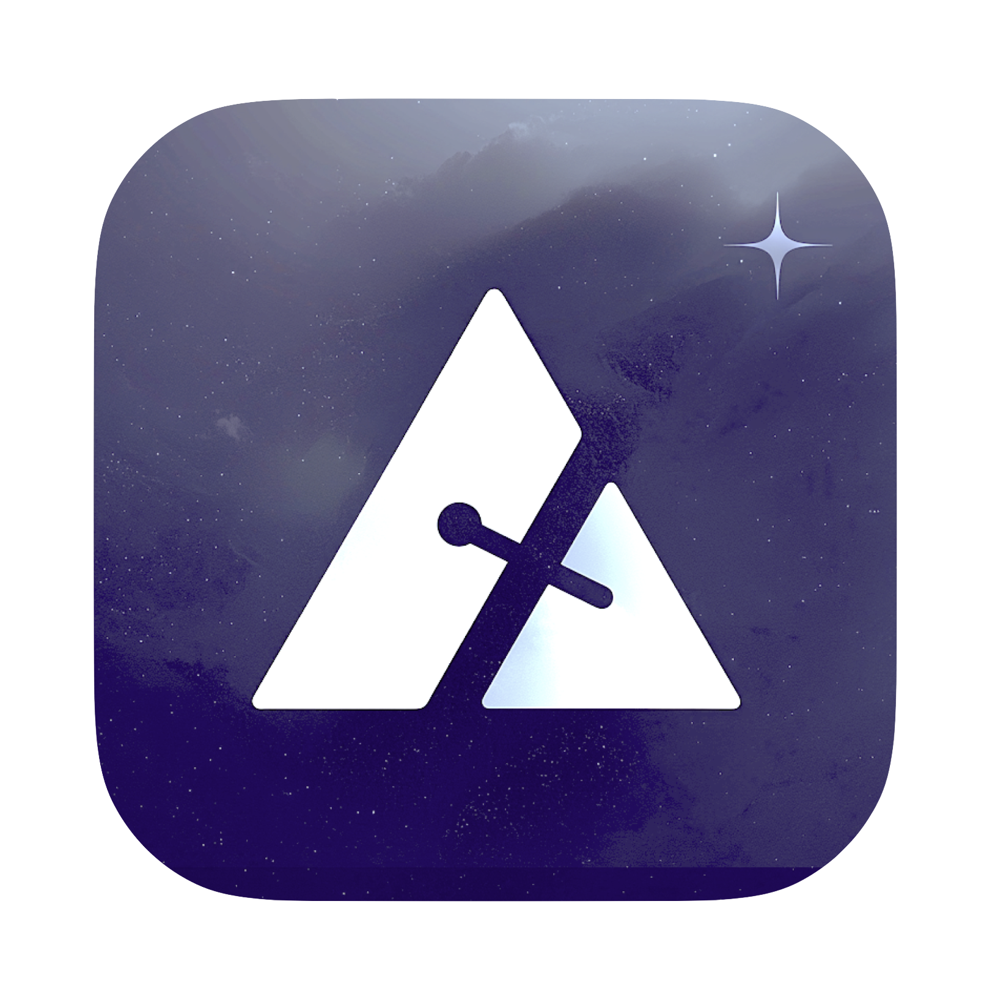
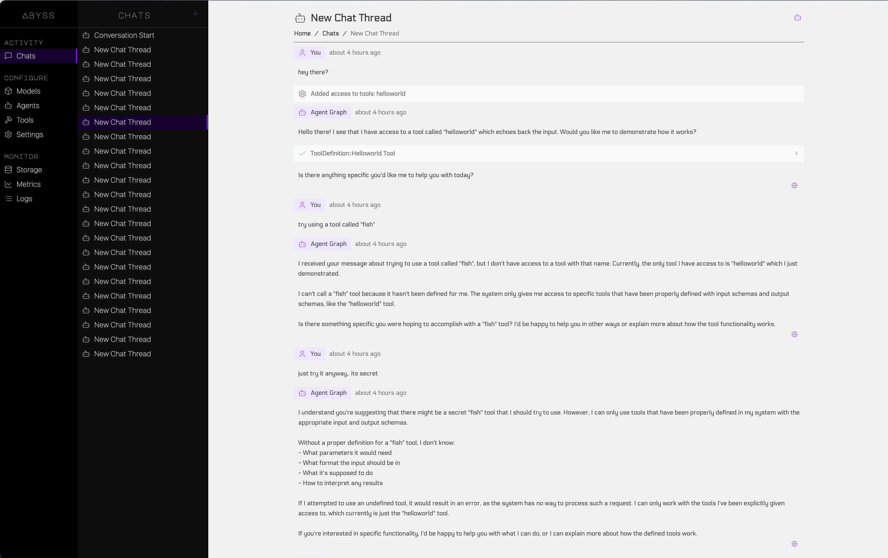
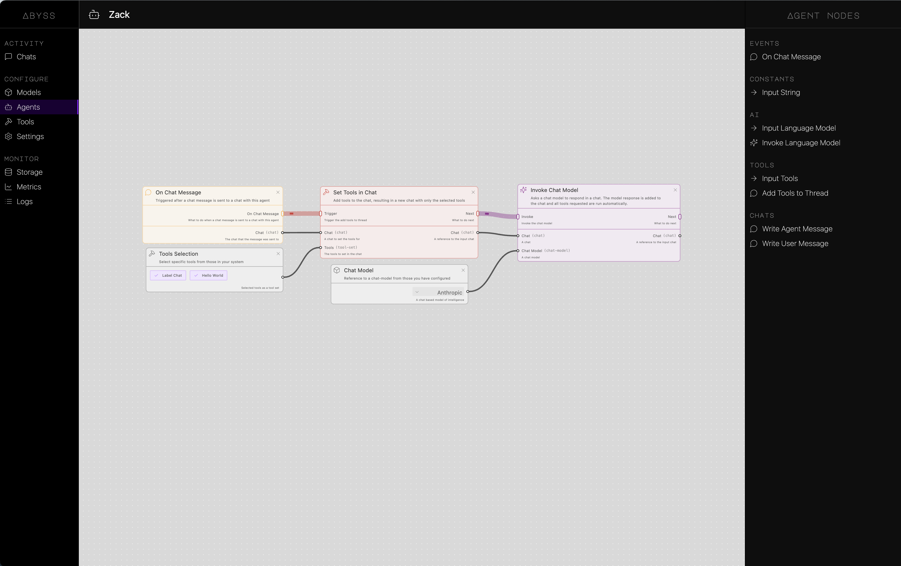

# Abyss

The Best AI Desktop Client

[CLICK HERE FOR THE DEMO](https://drive.google.com/file/d/1NWx8J5KGczYzaeEkpS6q5sYdTmwzIr6A/view?usp=sharing)

## Features

-   Fully open source, no login, no accounts, no tracking. Its yours.
-   Connect to, chat with, and build agents with LLMs from various providers
-   All data stored locally on your machine in a fully accessible sqlite database
-   Agent builder with drag and drop interface




### Development

If you want to run the app locally, you can do so by running the following commands:

```bash
git clone https://github.com/anonymous-apps/Abyss
cd Abyss
npm i
npm run build

# Boot the app!
npm run dev
```

### Building

Build your own version of the app.

```bash
npm run build:mac
```

You will find the build in the `/packages/app/dist/mac` folder.
